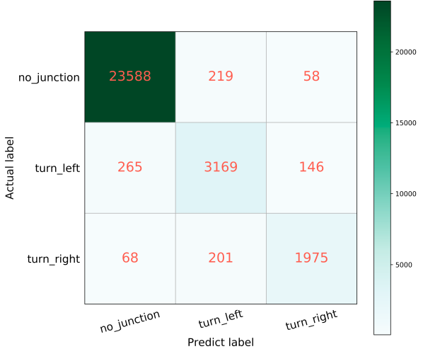
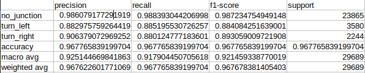
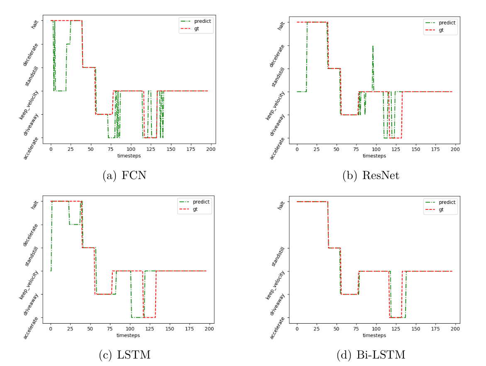

# DataDrivenManeuverIdentification
This repository contains codes for maneuver identification.

## Dependency
You can create a clean environment, and install below dependencies in terminal.

```sh
conda create --name envs01 python=3.6 -y
conda activate envs01
conda install tensorflow-gpu==1.10.0 -y
conda install keras=2.2.0 -y
conda install -c anaconda pandas==1.0.3 -y
conda install -c anaconda matplotlib==3.1.3 -y
conda install -c anaconda scikit-learn==0.22.1 -y
```

## Data Format
The dataset is from INTERACTION DATASET, the data format is as shown in https://interaction-dataset.com/details-and-format

the dataset is in the folder data, organized like below:
```
data
└── DR_USA_Intersection_EP0
    ├── trackfile_categorized_0.csv
    ├── trackfile_categorized_1.csv
    ├── trackfile_categorized_2.csv
    ├── trackfile_categorized_3.csv
    ├── trackfile_categorized_4.csv
    ├── trackfile_categorized_5.csv
    ├── trackfile_categorized_6.csv
    └── trackfile_categorized_7.csv
```

## Training
Open terminal in folder new_usa_data_master, firstly activate the env.
```sh
conda activate envs01
```
For training, there are 4 models available as mentioned in my thesis, FCN, RESNET, LSTM and BLSTM. There are in total 4 maneuver labels, turn, preceding, lane and vehiclestate.
One model is only responsible for one maneuver label. I will provide some examples commands in below.

to train a FCN model in turn maneuver, simply run:
```sh
python main.py -model FCN -epoch 200 -category turn
```

to train a RESNET model in preceding maneuver, simply run:
```sh
python main.py -model RESNET -epoch 200 -category preceding
```

to train a LSTM model in maneuver lane, simply run:
```sh
python main.py -model LSTM -epoch 200 -category lane
```

to train a BLSTM model in vehiclestate maneuver, simply run:
```sh
python main.py -model BLSTM -epoch 200 -category vehiclestate
```

Training log will be generated in folder trainlog after training.
you can run loss2.py to visulize the loss and accuracy during the training.
open loss2.py, edit the filename to the newly generated fog file under trainlog, and the epoch to the training epoch which is readable in filename.
```
    path = "./trainlog/"
    filename = "lstm-turn_724sample_2epoch.csv"
    epoch = 2
```

## Inference
Open terminal in folder new_usa_data_master, firstly activate the env.
```sh
conda activate envs01
```
For testing, there are 4 models available as mentioned in my thesis, FCN, RESNET, LSTM and BLSTM. There are in total 4 maneuver labels, turn, preceding, lane and vehiclestate.
One model is only responsible for one maneuver label. I will provide some examples commands in below. The relevant model needs to be trained before testing.

to test a RESBET model in turn maneuver, simply run:
```sh
python prediction.py -model RESNET -category turn -save_path ./results/turn/RESNET -model_path ./weights/ -model_name RESNET_turn_724sample_500epoch.h5
```

to test a FCN model in preceding maneuver, simply run:
```sh
python prediction.py -model FCN -category preceding -save_path ./results/preceding/FCN -model_path ./weights/ -model_name path_to_the_trained_model.h5
```

to test a LSTM model in lane maneuver, simply run:
```sh
python prediction.py -model LSTM -category lane -save_path ./results/lane/LSTM -model_path ./weights/ -model_name path_to_the_trained_model.h5
```

to test a BLSTM model in vehiclestate maneuver, simply run:
```sh
python prediction.py -model BLSTM -category vehiclestate -save_path ./results/vehiclestate/BLSTM -model_path ./weights/ -model_name path_to_the_trained_model.h5
```

## Demo
Open terminal in folder new_usa_data_master, firstly activate the env.
```sh
conda activate envs01
```

The resnet model has been provided, you can run the following commands directly
```sh
python prediction.py
```
The prediction results of the model on each sample is in the folder ./results/turn/RESNET/plots.
.
├── plots
│   ├── sample0_100.png
│   ├── sample10_100.png
│   ├── sample1_100.png
│   ├── sample11_99.png
│   ├── sample12_100.png
│   ├── sample13_100.png
│   ├── sample14_100.png
│   ├── sample15_100.png
│   ├── sample16_100.png
│   ├── ...
├── RESNET_turn_724sample_500epoch_classification_report.csv
└── RESNET_turn_724sample_500epoch_cm_matrix.png

Confusion matrix of the model is in the file  RESNET_turn_724sample_500epoch_cm_matrix.png, like following:


Classification_report is in the file
RESNET_turn_724sample_500epoch_classification_report.csv, like following:



## Examples of the result
Model results on vehicle state maneuver:


## Usage of INTERACTION Dataset

This project utilizes the [INTERACTION Dataset](https://interaction-dataset.com/) for its development and analysis. The dataset is described in the following paper:

```bibtex

@article{interactiondataset,
  title = {{INTERACTION} {Dataset}: {An} {INTERnational}, {Adversarial} and {Cooperative} {moTION} {Dataset} in {Interactive} {Driving} {Scenarios} with {Semantic} {Maps}},
  journal = {arXiv:1910.03088 Add to Citavi project by ArXiv ID[cs, eess]},
  author = {Zhan, Wei and Sun, Liting and Wang, Di and Shi, Haojie and Clausse, Aubrey and Naumann, Maximilian and K\"ummerle, Julius and K\"onigshof, Hendrik and Stiller, Christoph and de La Fortelle, Arnaud and Tomizuka, Masayoshi},
  month = sep,
  year = {2019}
}
```

